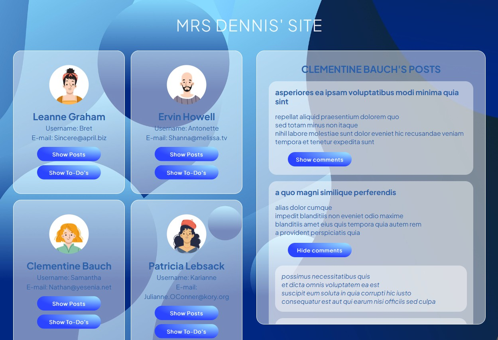

# GROUP ASSIGNMENT
This assignment marked our first encounter with collaboration using Git and GitHub. Through this project, we took our first steps towards mastering version control and streamlining our efforts towards a shared goal. 

## Highlights
- HTML - semantic markup for better accessibility and structure
- CSS - modern native CSS, utlizing nesting and variables
- JS - vanilla Javascript with no external libraries, to ensure a deeper understanding of core JS concepts
- Successful integration of data from external API

# The full details of the assignment are provided below - machine translated from Swedish, for your convenience!

> # About the task  
>  
> In this task, you will continue building on the previous task where you retrieved user data from an API. This time, you will extend your solution to display more detailed information, including the user's posts, comments, and to-do list. You will use JavaScript, HTML, and CSS to create a user-friendly and functional web application that integrates multiple APIs and presents relevant data in a clear and interactive way.  
>  
> You will also manage **version control with Git** throughout the entire process. You will work with Git both through **commands** and **interfaces** (such as GitHub Desktop or other GUI tools). This is to ensure efficient collaboration and versioning of your project.

> # What to Do  
>  
> ### 1. **Related Data – Posts**  
> - Use the URL `https://jsonplaceholder.typicode.com/posts` to retrieve all **posts** associated with a user.  
> - Each user has their own list of posts. This means that each post is linked to a specific user via `userId`.  
>  
> ### 2. **Test the API Link with Postman**  
> - Before starting your work, test the link `https://jsonplaceholder.typicode.com/posts` in an API testing tool like **Postman** or a similar tool.  
> - Testing the link provides an overview of the data, helping you understand the structure and content you will be working with.  
>  
> ### 3. **Retrieve Posts Belonging to a Specific User**  
> - When a user is clicked, retrieve all posts associated with that user based on their `userId`.  
> - Display these posts on the page in a user-friendly way. You can choose to display posts as a list, cards, or a table depending on your design.  
>  
> ### 4. **Display the User’s Posts on Click**  
> - When a user is clicked, the user’s posts should load and be displayed along with their basic information (such as name, username, and email) from the previous task.  
> - You need to implement functionality so that each user shows their own list of posts when clicked.

> ### 5. **Merge Branches with Pull Requests**  
> - When a feature is complete, create a **Pull Request** to merge your branch into the main branch (`main` or `master`) on GitHub.  
> - Pull Requests enable discussion and review of the code before merging.  
>  
> ### 6. **Handle Conflicts**  
> - If two people modify the same line of code, a conflict will arise when attempting to merge the changes. You must resolve the conflicts before the code can be merged. This can be done by manually editing the conflicting files and then committing the changes.  
>  
> ### 7. **Use GitHub for Collaboration**  
> - **GitHub** (or another Git repository system) will be an important platform for collaboration. Ensure you communicate about features, provide status updates, and review each other’s code via **Pull Requests**.  
>  